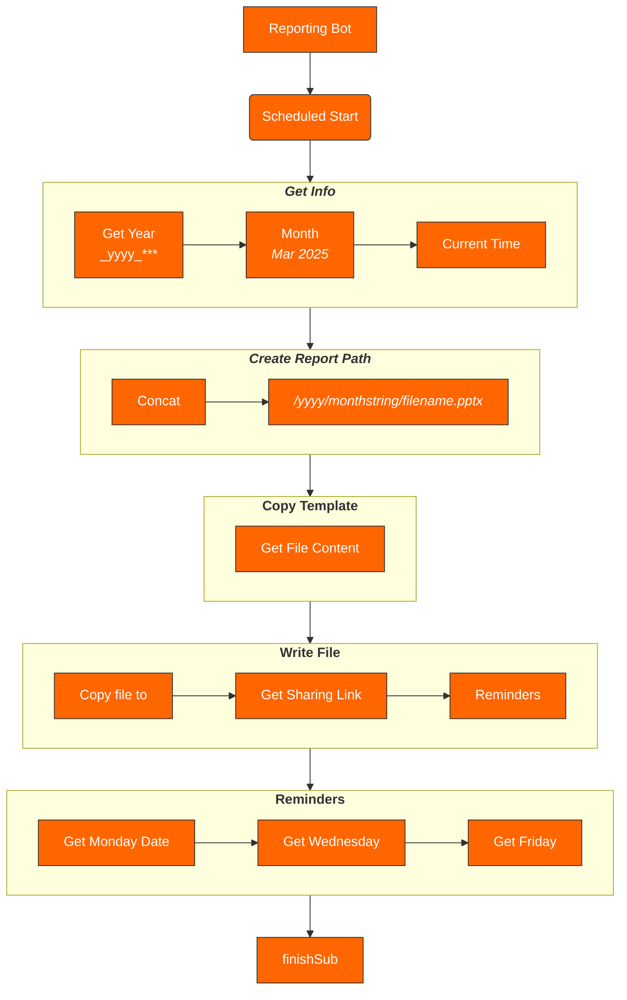

# PowerAutomate Script

### Flow diagram

```mermaid

flowchart TD
classDef default fill:#ff6600,stroke:#333,stroke-width:1px, color: #ffffff, primaryColor: red;
  A[Reporting Bot] --> B(Scheduled Start)
  B-->getinfo-->createpath[Create Path]-->copyTemplate-->writeNewfileSub-->sendReminidersSub-->finishSub

subgraph getinfo["`***Get Info***`"]
  direction LR
  dateinfo["Get Year <br> _yyyy_***"]-->
  monthInfo["`Month <br> _Mar 2025_`"]-->
  getCurrntTimeStamp["Current Time"]
end

subgraph createpath["`***Create Report Path***`"]
  direction LR
  concatVariables[Concat]-->pathstring["`_/yyyy/monthstring/filename.pptx_`"]
end


subgraph copyTemplate["`**Copy Template**`"]
    getFile[Get File Content]
end


subgraph writeNewfileSub["`**Write File**`"]
  direction LR
  writeNewFile[Copy file to]-->getfilelink[Get Sharing Link]-->remindersTime[Reminders]
end


subgraph sendReminidersSub["`**Reminders**`"]
  direction LR
  getNextMonday[Get Monday Date]-->getWednesayDate[Get Wednesday]-->getNextFridayDate[Get Friday]
end


```
